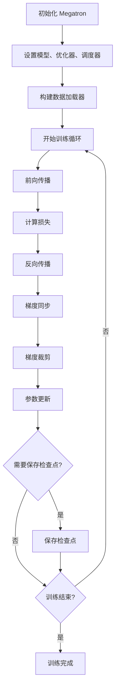

# Megatron-LM 架构与使用指南

## 目录

1. [项目概述](#1-项目概述)
2. [系统架构](#2-系统架构)
3. [代码结构](#3-代码结构)
4. [模型训练流程](#4-模型训练流程)
5. [核心API接口](#5-核心api接口)
6. [使用示例](#6-使用示例)
7. [配置参考](#7-配置参考)
8. [最佳实践](#8-最佳实践)

---

## 1. 项目概述

### 1.1 简介

Megatron-LM 是 NVIDIA 开发的大规模 Transformer 模型 GPU 优化训练框架，支持训练数百亿到万亿参数的语言模型。该框架提供了完整的分布式训练解决方案，包括：

- **多种并行策略**：张量并行、流水线并行、数据并行、专家并行、上下文并行
- **混合精度训练**：支持 FP16、BF16、FP8 等多种精度
- **丰富的模型支持**：GPT、BERT、T5、Mamba、MoE、多模态模型
- **生产就绪**：完整的工具链、监控、检查点管理

### 1.2 主要特性

| 特性类别 | 具体功能 |
|---------|---------|
| 并行策略 | 张量并行(TP)、流水线并行(PP)、数据并行(DP)、专家并行(EP)、上下文并行(CP)、序列并行 |
| 模型架构 | GPT、BERT、T5、Mamba、MoE、视觉语言模型 |
| 训练优化 | 梯度累积、激活重计算、混合精度、CUDA Graph、Flash Attention |
| 内存优化 | ZeRO优化器、分布式优化器、FSDP、梯度检查点 |
| 容错机制 | 自动重试、检查点恢复、训练状态持久化 |
| 工具链 | 数据预处理、推理服务、性能测试、模型转换 |

### 1.3 环境信息

- **代码位置**：`D:\02_source\Megatron-LM`
- **主要版本**：基于 Megatron-Core 的现代化实现
- **依赖关系**：PyTorch、NCCL、CUDA、Apex

---

## 2. 系统架构

### 2.1 整体架构设计

```
┌─────────────────────────────────────────────────────────────────────┐
│                         Megatron-LM 架构                             │
├─────────────────────────────────────────────────────────────────────┤
│  ┌─────────────────┐  ┌─────────────────┐  ┌─────────────────┐      │
│  │  预训练脚本     │  │   微调脚本      │  │   推理脚本      │      │
│  │ pretrain_gpt.py │  │  train_rl.py    │  │ inference*.py   │      │
│  └────────┬────────┘  └────────┬────────┘  └────────┬────────┘      │
│           │                    │                    │                │
│  ┌────────▼────────────────────▼────────────────────▼────────┐     │
│  │              Training Module (训练模块)                     │     │
│  │  - training.py (训练循环)                                  │     │
│  │  - arguments.py (参数解析)                                 │     │
│  │  - checkpointing.py (检查点管理)                           │     │
│  └────────┬──────────────────────────────────────────────────┘     │
│           │                                                        │
│  ┌────────▼───────────────────────────────────────────────────┐   │
│  │           Core Module (核心模块 - 现代实现)                 │   │
│  │  ┌────────────────┐  ┌────────────────┐                   │   │
│  │  │ Models         │  │ Parallel       │                   │   │
│  │  │ - GPT          │  │ - Tensor TP    │                   │   │
│  │  │ - BERT         │  │ - Pipeline PP  │                   │   │
│  │  │ - T5           │  │ - Data DP      │                   │   │
│  │  │ - Mamba        │  │ - Context CP   │                   │   │
│  │  └────────────────┘  └────────────────┘                   │   │
│  │  ┌────────────────┐  ┌────────────────┐                   │   │
│  │  │ Transformer    │  │ Datasets       │                   │   │
│  │  │ - Attention    │  │ - GPT Dataset  │                   │   │
│  │  │ - MLP          │  │ - BERT Dataset │                   │   │
│  │  │ - LayerNorm    │  │ - Blended      │                   │   │
│  │  └────────────────┘  └────────────────┘                   │   │
│  └─────────────────────────────────────────────────────────────┘   │
│           │                                                        │
│  ┌────────▼───────────────────────────────────────────────────┐   │
│  │         Legacy Module (传统模块 - 向后兼容)                 │   │
│  │  - legacy/model/   - legacy/mpu/   - legacy/fused_kernels/ │   │
│  └─────────────────────────────────────────────────────────────┘   │
└─────────────────────────────────────────────────────────────────────┘
```

### 2.2 核心组件

#### 2.2.1 并行计算组件

Megatron-LM 实现了多种并行策略的组合：

```python
# 并行初始化示例
initialize_model_parallel(
    tensor_model_parallel_size_=8,      # 张量并行
    pipeline_model_parallel_size_=4,     # 流水线并行
    data_parallel_size_=2,               # 数据并行
    context_parallel_size_=2,            # 上下文并行
    virtual_pipeline_model_parallel_size_=2  # 虚拟流水线
)

# 总GPU数 = 8 × 4 × 2 × 2 = 128 GPUs
```

**并行策略详解**：

1. **张量并行 (Tensor Parallelism, TP)**
   - 将模型权重在多个GPU上切分
   - 适合模型很大、单个GPU无法容纳的场景
   - 通信密集，需要高带宽

2. **流水线并行 (Pipeline Parallelism, PP)**
   - 将模型层按顺序分布到多个GPU
   - 减少单点内存压力
   - 引入"气泡"开销

3. **数据并行 (Data Parallelism, DP)**
   - 不同GPU处理不同数据批次
   - 通过梯度同步保证一致性
   - 可使用 ZeRO 优化减少内存

4. **上下文并行 (Context Parallelism, CP)**
   - 将长序列切分到多个GPU
   - 适合超长上下文训练
   - 支持环形和分层通信

5. **专家并行 (Expert Parallelism, EP)**
   - 专用于 MoE 模型
   - 将不同专家分布到不同GPU
   - 动态路由和负载均衡

#### 2.2.2 训练优化组件

| 优化技术 | 说明 | 适用场景 |
|---------|------|---------|
| 混合精度训练 | FP16/BF16/FP8 | 加速训练、减少内存 |
| 梯度累积 | 累积多步后更新 | 模拟大批量 |
| 激活重计算 | 前向时不保存激活 | 减少内存、增加计算 |
| Flash Attention | 优化注意力计算 | 加速、减少内存 |
| CUDA Graph | 减少CPU开销 | 稳定场景加速 |
| 梯度检查点 | 选择性保存激活 | 内存和计算平衡 |

---

## 3. 代码结构

### 3.1 顶层目录

```
Megatron-LM/
├── megatron/                    # 核心代码
│   ├── core/                   # 现代核心实现 (推荐使用)
│   ├── legacy/                 # 传统实现 (向后兼容)
│   ├── training/               # 训练工具
│   ├── post_training/          # 训练后处理
│   └── rl/                     # 强化学习
│
├── examples/                   # 示例和配置
│   ├── gpt3/                   # GPT-3 配置
│   ├── bert/                   # BERT 配置
│   ├── llama/                  # LLaMA 配置
│   ├── mixtral/                # Mixtral MoE 配置
│   ├── inference/              # 推理示例
│   └── multimodal/             # 多模态示例
│
├── tools/                      # 工具脚本
│   ├── preprocess_data.py      # 数据预处理
│   ├── run_text_generation_server.py  # 推理服务
│   ├── run_inference_performance_test.py  # 性能测试
│   └── merge_datasets.py       # 数据集合并
│
├── scripts/                    # 辅助脚本
│   └── academic_paper_scripts/ # 论文复现脚本
│
├── pretrain_gpt.py            # GPT 预训练入口
├── pretrain_bert.py           # BERT 预训练入口
├── pretrain_t5.py             # T5 预训练入口
├── pretrain_mamba.py          # Mamba 预训练入口
├── train_rl.py                # 强化学习训练
│
├── gpt_builders.py            # GPT 模型构建器
├── mamba_builders.py          # Mamba 模型构建器
├── model_provider.py          # 统一模型提供者
│
└── README.md                  # 项目文档
```

### 3.2 核心模块详解

#### 3.2.1 megatron/core/

现代核心实现，推荐使用：

```
megatron/core/
├── transformer/                    # Transformer 组件
│   ├── transformer_config.py      # 配置管理
│   ├── transformer_layer.py       # 层实现
│   ├── transformer_block.py       # 块实现
│   ├── attention.py               # 注意力机制
│   ├── mlp.py                     # MLP 层
│   └── module.py                  # 基础模块
│
├── models/                         # 模型定义
│   ├── gpt/                       # GPT 模型
│   │   ├── gpt_model.py
│   │   └── gpt_embedding.py
│   ├── bert/                      # BERT 模型
│   ├── T5/                        # T5 模型
│   └── mamba/                     # Mamba 模型
│
├── tensor_parallel/                # 张量并行
│   ├── layers.py                  # 并行层
│   ├── random.py                  # 随机数管理
│   └── cross_entropy.py           # 交叉熵
│
├── pipeline_parallel/              # 流水线并行
│   ├── p2p_communication.py       # 点对点通信
│   └── schedules.py               # 调度策略
│
├── distributed/                    # 分布式训练
│   ├── distributed_data_utils.py  # 数据工具
│   └── checkpointing.py           # 检查点
│
├── datasets/                       # 数据集
│   ├── gpt_dataset.py
│   ├── bert_dataset.py
│   └── blended_dataset.py
│
├── optimizer/                      # 优化器
│   └── optimizer.py
│
├── config.py                       # 配置管理
├── parallel_state.py               # 并行状态
└── utils.py                        # 工具函数
```

#### 3.2.2 megatron/training/

训练相关工具：

```
megatron/training/
├── training.py                      # 主训练循环
├── arguments.py                     # 命令行参数
├── yaml_arguments.py                # YAML 配置
├── checkpointing.py                 # 检查点管理
├── tokenizer/                       # 分词器
│   ├── bert_tokenizer.py
│   └── gpt2_tokenizer.py
└── datasets/                        # 训练数据集
    ├── gpt_dataset.py
    └── bert_dataset.py
```

#### 3.2.3 megatron/legacy/

传统实现，向后兼容：

```
megatron/legacy/
├── model/                          # 传统模型
├── mpu/                            # 模型并行单元
├── fused_kernels/                  # CUDA 内核
└── data/                           # 数据处理
```

---

## 4. 模型训练流程

### 4.1 完整训练流程



### 4.2 代码流程详解

#### 4.2.1 主入口 (pretrain_gpt.py)

```python
def main():
    # 1. 初始化 Megatron
    initialize_megatron(
        extra_args_provider=model_provider,
        args_defaults={
            'no_load_rng': True,
            'no_load_optim': True
        }
    )

    # 2. 构建模型、优化器、学习率调度器
    model, optimizer, opt_param_scheduler = setup_model_and_optimizer(
        model_provider=model_provider,
        model_type=GPTModel,
        checkpointing_context=get_checkpointing_context()
    )

    # 3. 构建数据加载器
    train_data_iterator, valid_data_iterator, test_data_iterator = \
        build_train_valid_test_data_iterators(
            train_valid_test_dataset_provider=train_valid_test_datasets_provider
        )

    # 4. 执行训练
    train(
        forward_step_func=forward_step,
        model=model,
        optimizer=optimizer,
        opt_param_scheduler=opt_param_scheduler,
        train_data_iterator=train_data_iterator,
        valid_data_iterator=valid_data_iterator,
        test_data_iterator=test_data_iterator
    )
```

#### 4.2.2 训练循环 (training.py)

```python
def train(forward_step_func, model, optimizer, opt_param_scheduler,
          train_data_iterator, valid_data_iterator, ...):

    # 初始化
    iteration = args.iteration
    timers = get_timers()

    # 主训练循环
    while iteration < args.train_iters and not args.exit_duration_condition:
        # 更新 microbatch 数量
        update_num_microbatches(args.consumed_train_samples)

        # 计时开始
        timers('batch-gen').start()
        timers('batch-gen').stop()

        # 执行训练步骤
        loss_dict, skipped_iter, should_checkpoint, should_exit, \
        exit_code, grad_norm, num_zeros_in_grad, _ = train_step(
            forward_step_func=forward_step_func,
            data_iterator=train_data_iterator,
            model=model,
            optimizer=optimizer,
            opt_param_scheduler=opt_param_scheduler,
            config=config
        )

        # 更新学习率
        if update_successful:
            opt_param_scheduler.step(increment=increment)

        # 保存检查点
        if should_checkpoint:
            save_checkpoint_and_time(iteration, model, optimizer,
                                     opt_param_scheduler)

        # 验证
        if iteration % args.eval_interval == 0:
            evaluate_and_print_progress(
                forward_step_func=forward_step_func,
                data_iterator=valid_data_iterator,
                model=model,
                iteration=iteration
            )

        iteration += 1
```

#### 4.2.3 训练步骤 (train_step)

```python
def train_step(forward_step_func, data_iterator, model,
               optimizer, opt_param_scheduler, config):

    # 1. 梯度清零
    for model_chunk in model:
        model_chunk.zero_grad_buffer()
    optimizer.zero_grad()

    # 2. 前向-反向传播
    losses_reduced = forward_backward_func(
        forward_step_func=forward_step_func,
        data_iterator=data_iterator,
        model=model,
        num_microbatches=get_num_microbatches(),
        seq_length=args.seq_length,
        micro_batch_size=args.micro_batch_size,
        forward_only=False
    )

    # 3. 梯度同步和更新
    update_successful, grad_norm, num_zeros_in_grad = optimizer.step()

    # 4. 更新学习率
    if update_successful:
        increment = get_finetuning_num_samples(args.consumed_train_samples)
        opt_param_scheduler.step(increment=increment)

    # 5. 计算损失字典
    loss_dict = {'lm loss': losses_reduced.mean()}

    return loss_dict, skipped_iter, should_checkpoint, \
           should_exit, exit_code, grad_norm, num_zeros_in_grad, _
```

#### 4.2.4 前向传播

```python
def forward_step(data_iterator, model):
    """前向传播步骤"""

    # 获取数据
    tokens, labels, loss_mask = get_batch(data_iterator)

    # 前向传播
    logits = model(tokens)

    # 计算损失
    losses = mcore.model.GPTLossProvider(
        vocab_size=args.padded_vocab_size,
        loss_mask=loss_mask
    )(logits, labels)

    # 减少损失到所有进程
    averaged_losses = average_losses_across_data_parallel_group(losses)

    return averaged_losses
```

### 4.3 检查点管理

```python
def save_checkpoint(iteration, model, optimizer, opt_param_scheduler):
    """保存训练检查点"""

    # 1. 准备保存目录
    checkpoint_name = f"iter_{iteration:07d}"
    save_dir = os.path.join(args.save, checkpoint_name)

    # 2. 收集模型状态
    state_dict = {
        'iteration': iteration,
        'model': model[0].state_dict(),
        'optimizer': optimizer.state_dict(),
        'scheduler': opt_param_scheduler.state_dict(),
        'args': args
    }

    # 3. 保存到磁盘
    if args.use_distributed_checkpointing:
        # 使用分布式检查点
        from megatron.core import dist_checkpointing
        dist_checkpointing.save(state_dict, save_dir)
    else:
        # 传统保存方式
        torch.save(state_dict, os.path.join(save_dir, 'mp_rank_00_model_states.pt'))
```

### 4.4 数据加载流程

```python
class GPTDataset(torch.utils.data.Dataset):
    """GPT 数据集实现"""

    def __init__(self, indexed_dataset, config):
        self.indexed_dataset = indexed_dataset
        self.seq_length = config.seq_length
        self.vocab_size = config.vocab_size

    def __getitem__(self, idx):
        """获取单个样本"""
        # 获取文本 tokens
        tokens = self.indexed_dataset.get(idx)

        # 构建 input 和 label
        input_ids = tokens[:-1]
        labels = tokens[1:]

        # 构建 loss_mask
        loss_mask = torch.ones_like(input_ids)

        return {
            'tokens': input_ids,
            'labels': labels,
            'loss_mask': loss_mask
        }

    def __len__(self):
        return len(self.indexed_dataset)
```

---

## 5. 核心API接口

### 5.1 模型构建 API

#### 5.1.1 GPT 模型构建

```python
# 位置: gpt_builders.py
def gpt_builder(args, pre_process=True, post_process=True,
                vp_stage=None, config=None, pg_collection=None):
    """
    构建 GPT 模型

    Args:
        args: 训练配置参数
        pre_process: 是否包含预处理层 (embedding)
        post_process: 是否包含后处理层 (输出层)
        vp_stage: 虚拟流水线并行阶段
        config: 外部传入的配置对象
        pg_collection: 进程组集合

    Returns:
        model: 构建好的 GPT 模型

    Example:
        >>> model = gpt_builder(
        ...     args,
        ...     pre_process=True,
        ...     post_process=True,
        ...     config=transformer_config
        ... )
    """

    # 1. 加载配置
    if config is None:
        config = core_transformer_config_from_args(args, "language_model")

    # 2. 获取层规范
    use_te = args.transformer_engine is not None and args.transformer_engine
    transformer_layer_spec = _get_transformer_layer_spec(use_te, config)

    # 3. 构建模型
    model = GPTModel(
        config=config,
        transformer_layer_spec=transformer_layer_spec,
        vocab_size=args.padded_vocab_size,
        max_sequence_length=args.max_position_embeddings,
        pre_process=pre_process,
        post_process=post_process,
        fp16_lm_cross_entropy=args.fp16_lm_cross_entropy,
        parallel_output=True,
        position_embedding_type=args.position_embedding_type,
        rotary_percent=args.rotary_percent,
        rotary_base=args.rotary_base,
        seq_len_interpolation_factor=args.seq_len_interpolation_factor
    )

    return model
```

#### 5.1.2 统一模型提供者

```python
# 位置: model_provider.py
def model_provider(model_builder: Callable,
                  pre_process=True,
                  post_process=True,
                  vp_stage=None,
                  config=None,
                  pg_collection=None) -> Union[GPTModel, MambaModel]:
    """
    通用模型提供者接口

    Args:
        model_builder: 模型构建器函数 (如 gpt_builder)
        pre_process: 是否包含预处理层
        post_process: 是否包含后处理层
        vp_stage: 虚拟流水线并行阶段
        config: 模型配置对象
        pg_collection: 进程组集合

    Returns:
        model: 构建好的模型实例

    Example:
        >>> model = model_provider(
        ...     model_builder=gpt_builder,
        ...     pre_process=True,
        ...     post_process=True,
        ...     config=config
        ... )
    """

    # 1. 内存历史记录 (可选)
    if args.record_memory_history:
        torch.cuda.memory._record_memory_history(True, trace_alloc_max_entries=50000)

    # 2. ModelOpt 支持 (可选)
    if has_nvidia_modelopt and getattr(args, 'modelopt_enabled', False):
        model_builder = modelopt_gpt_mamba_builder

    # 3. 调用模型构建器
    return model_builder(args, pre_process, post_process, vp_stage, config, pg_collection)
```

### 5.2 数据加载 API

#### 5.2.1 数据集构建器

```python
def train_valid_test_datasets_provider(train_val_test_num_samples, vp_stage=None):
    """
    构建 训练/验证/测试 数据集

    Args:
        train_val_test_num_samples: 各数据集的样本数量元组
                                    (train_samples, valid_samples, test_samples)
        vp_stage: 虚拟流水线并行阶段

    Returns:
        (train_ds, valid_ds, test_ds): 三个数据集实例

    Example:
        >>> num_samples = (1000000, 10000, 10000)
        >>> train_ds, valid_ds, test_ds = train_valid_test_datasets_provider(num_samples)
    """

    # 1. 构建配置
    config = core_gpt_dataset_config_from_args(args)

    # 2. 选择数据集类型
    if args.sft:
        dataset_type = SFTDataset
    elif args.mock_data:
        dataset_type = MockGPTDataset
    elif args.fim_data:
        dataset_type = GPTFIMDataset
    else:
        dataset_type = GPTDataset

    # 3. 构建数据集
    train_ds, valid_ds, test_ds = BlendedMegatronDatasetBuilder(
        dataset_type,
        train_val_test_num_samples,
        partial(is_dataset_built_on_rank, vp_stage=vp_stage),
        config
    ).build()

    return train_ds, valid_ds, test_ds
```

#### 5.2.2 数据采样器

```python
class MegatronPretrainingSampler:
    """
    Megatron 预训练数据采样器

    支持分布式训练中的数据分片和样本分配

    Args:
        total_samples: 数据集总样本数
        consumed_samples: 已消耗的样本数 (用于恢复训练)
        micro_batch_size: 单个 micro batch 大小
        data_parallel_rank: 当前进程的数据并行 rank
        data_parallel_size: 数据并行进程总数

    Example:
        >>> sampler = MegatronPretrainingSampler(
        ...     total_samples=1000000,
        ...     consumed_samples=0,
        ...     micro_batch_size=4,
        ...     data_parallel_rank=0,
        ...     data_parallel_size=8
        ... )
        >>> for batch_indices in sampler:
        ...     # 处理批次
        ...     pass
    """

    def __init__(self, total_samples, consumed_samples, micro_batch_size,
                 data_parallel_rank, data_parallel_size):
        self.total_samples = total_samples
        self.consumed_samples = consumed_samples
        self.micro_batch_size = micro_batch_size
        self.data_parallel_rank = data_parallel_rank
        self.data_parallel_size = data_parallel_size

        # 计算批次大小
        self.batch_size = self.micro_batch_size * self.data_parallel_size

    def __iter__(self):
        """生成批次索引"""
        batch_size = self.batch_size

        # 计算当前 rank 的起始位置
        start = self.consumed_samples + self.data_parallel_rank * self.micro_batch_size

        # 生成批次
        while start < self.total_samples:
            end = min(start + batch_size, self.total_samples)

            # 当前 rank 的索引
            for idx in range(start, end, self.micro_batch_size):
                yield list(range(idx, min(idx + self.micro_batch_size, end)))

            start = end
```

### 5.3 并行训练 API

#### 5.3.1 并行初始化

```python
def initialize_model_parallel(
    tensor_model_parallel_size_: int = 1,
    pipeline_model_parallel_size_: int = 1,
    data_parallel_size_: int = 1,
    context_parallel_size_: int = 1,
    expert_model_parallel_size_: int = 1,
    expert_tensor_parallel_size_: int = 1,
    hybrid_context_parallel: bool = False,
    pipeline_model_parallel_split_rank: Optional[int] = None,
    virtual_pipeline_model_parallel_size_: Optional[int] = None,
    **kwargs
):
    """
    初始化模型并行配置

    Args:
        tensor_model_parallel_size_: 张量并行大小
        pipeline_model_parallel_size_: 流水线并行大小
        data_parallel_size_: 数据并行大小
        context_parallel_size_: 上下文并行大小
        expert_model_parallel_size_: 专家模型并行大小
        expert_tensor_parallel_size_: 专家张量并行大小
        hybrid_context_parallel: 是否使用混合上下文并行
        pipeline_model_parallel_split_rank: 流水线分割 rank
        virtual_pipeline_model_parallel_size_: 虚拟流水线大小

    Example:
        >>> initialize_model_parallel(
        ...     tensor_model_parallel_size_=4,
        ...     pipeline_model_parallel_size_=2,
        ...     data_parallel_size_=2,
        ...     context_parallel_size_=1
        ... )
        >>> # 总 GPU 数 = 4 × 2 × 2 × 1 = 16
    """

    # 1. 验证配置
    world_size = torch.distributed.get_world_size()
    assert world_size >= tensor_model_parallel_size_ * pipeline_model_parallel_size_

    # 2. 初始化张量并行组
    _initialize_tensor_model_parallel(tensor_model_parallel_size_)

    # 3. 初始化流水线并行组
    _initialize_pipeline_model_parallel(
        pipeline_model_parallel_size_,
        pipeline_model_parallel_split_rank,
        virtual_pipeline_model_parallel_size_
    )

    # 4. 初始化数据并行组
    _initialize_data_parallel(data_parallel_size_)

    # 5. 初始化上下文并行组
    _initialize_context_parallel(context_parallel_size_)

    # 6. 初始化全局内存缓冲区
    _initialize_global_memory_buffer()
```

#### 5.3.2 张量并行层

```python
class ColumnParallelLinear(torch.nn.Module):
    """
    列并行线性层

    将权重矩阵按列分割到多个 GPU，适用于输出维度较大的线性层

    Args:
        input_size: 输入维度
        output_size: 输出维度
        bias: 是否使用偏置
        gather_output: 是否收集所有分区的输出
        init_method: 参数初始化方法

    Example:
        >>> layer = ColumnParallelLinear(
        ...     input_size=4096,
        ...     output_size=14336,
        ...     bias=True,
        ...     gather_output=True
        ... )
        >>> output = layer(input)
    """

    def __init__(self, input_size, output_size, bias=True,
                 gather_output=True, init_method=None):
        super().__init__()

        # 1. 获取张量并行配置
        world_size = get_tensor_model_parallel_world_size()
        self.output_size_per_partition = divide(output_size, world_size)

        # 2. 创建权重参数
        self.weight = torch.nn.Parameter(
            torch.empty(self.output_size_per_partition, input_size)
        )
        if bias:
            self.bias = torch.nn.Parameter(torch.empty(self.output_size_per_partition))

        # 3. 初始化参数
        if init_method is not None:
            init_method(self.weight)
        if bias:
            torch.nn.init.zeros_(self.bias)

    def forward(self, input_):
        """前向传播"""
        # 1. 线性变换
        output_parallel = F.linear(input_, self.weight)

        # 2. 收集输出 (如果需要)
        if self.gather_output:
            output = _gather_output(output_parallel)
        else:
            output = output_parallel

        # 3. 添加偏置
        if self.bias is not None:
            output = output + self.bias

        return output
```

### 5.4 配置管理 API

#### 5.4.1 从参数构建配置

```python
def core_transformer_config_from_args(args, model_type='language_model'):
    """
    从命令行参数构建 Transformer 配置

    Args:
        args: 包含所有配置的命名空间对象
        model_type: 模型类型 ('language_model', 'encoder_decoder', 等)

    Returns:
        TransformerConfig: 配置对象

    Example:
        >>> config = core_transformer_config_from_args(args, 'language_model')
        >>> model = GPTModel(config=config, ...)
    """

    # 1. 创建基础配置
    config = TransformerConfig(
        # 模型架构
        num_layers=args.num_layers,
        hidden_size=args.hidden_size,
        ffn_hidden_size=args.ffn_hidden_size,
        num_attention_heads=args.num_attention_heads,
        kv_channels=args.kv_channels,

        # 正则化
        prenorm=args.prenorm,
        layernorm_epsilon=args.layernorm_epsilon,
        hidden_dropout=args.hidden_dropout,
        attention_dropout=args.attention_dropout,

        # 激活函数
        activation=args.activation_func,
        gated_linear_unit=args.gated_linear_unit,
        activation_in_fp32=args.activation_in_fp32,

        # 位置编码
        position_embedding_type=args.position_embedding_type,
        rotary_percent=args.rotary_percent,
        rotary_base=args.rotary_base,
        seq_len_interpolation_factor=args.seq_len_interpolation_factor,

        # 并行配置
        tensor_model_parallel_size=args.tensor_model_parallel_size,
        pipeline_model_parallel_size=args.pipeline_model_parallel_size,
        sequence_parallel=args.sequence_parallel,

        # 精度
        fp16=args.fp16,
        bf16=args.bf16,
        params_dtype=args.params_dtype,

        # 优化
        apply_layernorm_1p=args.apply_layernorm_1p,
        apply_rope_scaling=args.use_rope_scaling,

        # MoE 配置
        num_moe_experts=args.num_moe_experts,
        moe_router_topk=args.moe_router_topk,
        moe_router_load_balancing_type=args.moe_router_load_balancing_type,
        moe_aux_loss_coeff=args.moe_aux_loss_coeff,
    )

    return config
```

#### 5.4.2 YAML 配置支持

```python
# 位置: megatron/training/yaml_arguments.py
def core_transformer_config_from_yaml(args, config_path, model_type):
    """
    从 YAML 文件加载配置

    Args:
        args: 命令行参数
        config_path: YAML 配置文件路径
        model_type: 模型类型

    Returns:
        TransformerConfig: 配置对象

    Example:
        # config.yaml 内容:
        # model:
        #   num_layers: 32
        #   hidden_size: 4096
        #
        >>> config = core_transformer_config_from_yaml(
        ...     args,
        ...     'config.yaml',
        ...     'language_model'
        ... )
    """

    # 1. 读取 YAML 文件
    import yaml
    with open(config_path, 'r') as f:
        yaml_config = yaml.safe_load(f)

    # 2. 获取模型配置部分
    model_config = yaml_config.get('model', {})

    # 3. 构建配置对象
    config = TransformerConfig(
        num_layers=model_config.get('num_layers', args.num_layers),
        hidden_size=model_config.get('hidden_size', args.hidden_size),
        ffn_hidden_size=model_config.get('ffn_hidden_size', args.ffn_hidden_size),
        # ... 其他参数
    )

    return config
```

---

## 6. 使用示例

### 6.1 GPT 模型训练

#### 6.1.1 小型 GPT 模型训练 (单机多卡)

```bash
# 训练 125M 参数的 GPT 模型
torchrun --nproc_per_node=8 pretrain_gpt.py \
    --use-mcore-models \
    --num-layers 12 \
    --hidden-size 768 \
    --ffn-hidden-size 3072 \
    --num-attention-heads 12 \
    --seq-length 1024 \
    --max-position-embeddings 1024 \
    --micro-batch-size 8 \
    --global-batch-size 64 \
    --lr 0.0005 \
    --min-lr 0.00005 \
    --lr-decay-style cosine \
    --weight-decay 0.1 \
    --adam-beta1 0.9 \
    --adam-beta2 0.95 \
    --train-samples 10000000 \
    --lr-decay-samples 9000000 \
    --lr-warmup-samples 10000 \
    --tensor-model-parallel-size 1 \
    --pipeline-model-parallel-size 1 \
    --sequence-parallel \
    --bf16 \
    --save checkpoints/gpt_125m \
    --save-interval 2000 \
    --eval-interval 1000 \
    --eval-iters 100 \
    --log-interval 10 \
    --tensorboard-dir tensorboard_logs
```

#### 6.1.2 大型 GPT 模型训练 (多机多卡)

```bash
# 训练 7B 参数的 GPT 模型 (使用 4D 并行)
torchrun --nnodes=4 --nproc_per_node=8 pretrain_gpt.py \
    --use-mcore-models \
    --num-layers 32 \
    --hidden-size 4096 \
    --ffn-hidden-size 14336 \
    --num-attention-heads 32 \
    --seq-length 2048 \
    --max-position-embeddings 2048 \
    --micro-batch-size 2 \
    --global-batch-size 512 \
    --lr 0.00015 \
    --min-lr 0.00001 \
    --lr-decay-style cosine \
    --weight-decay 0.1 \
    --adam-beta1 0.9 \
    --adam-beta2 0.95 \
    --train-samples 300000000 \
    --lr-decay-samples 270000000 \
    --lr-warmup-samples 30000 \
    --tensor-model-parallel-size 2 \
    --pipeline-model-parallel-size 4 \
    --data-parallel-size 4 \
    --sequence-parallel \
    --bf16 \
    --save checkpoints/gpt_7b \
    --save-interval 10000 \
    --eval-interval 5000 \
    --eval-iters 100
```

### 6.2 LLaMA 模型训练

```bash
# LLaMA-3 8B 训练 (使用 FP8 和 Flash Attention)
torchrun --nproc_per_node=8 pretrain_gpt.py \
    --use-mcore-models \
    --num-layers 32 \
    --hidden-size 4096 \
    --ffn-hidden-size 14336 \
    --num-attention-heads 32 \
    --group-query-attention \
    --num-query-groups 8 \
    --seq-length 8192 \
    --max-position-embeddings 8192 \
    --position-embedding-type rope \
    --rotary-base 1000000 \
    --swiglu \
    --micro-batch-size 1 \
    --global-batch-size 128 \
    --lr 0.00015 \
    --min-lr 0.00001 \
    --lr-decay-style cosine \
    --bf16 \
    --fp8-format hybrid \
    --fp8-amax-history-len 1024 \
    --use-flash-attn \
    --tensor-model-parallel-size 1 \
    --context-parallel-size 2 \
    --sequence-parallel \
    --save checkpoints/llama3_8b \
    --save-interval 5000
```

### 6.3 MoE 模型训练 (Mixtral)

```bash
# Mixtral 8x7B MoE 训练
torchrun --nnodes=8 --nproc_per_node=8 pretrain_gpt.py \
    --use-mcore-models \
    --num-layers 32 \
    --hidden-size 4096 \
    --ffn-hidden-size 14336 \
    --num-attention-heads 32 \
    --num-experts 8 \
    --moe-router-topk 2 \
    --moe-router-load-balancing-type aux_loss \
    --moe-aux-loss-coeff 1e-2 \
    --moe-grouped-gemm \
    --seq-length 2048 \
    --micro-batch-size 1 \
    --global-batch-size 256 \
    --lr 0.00015 \
    --tensor-model-parallel-size 1 \
    --pipeline-model-parallel-size 4 \
    --expert-model-parallel-size 8 \
    --sequence-parallel \
    --bf16 \
    --save checkpoints/mixtral_8x7b
```

### 6.4 数据预处理

#### 6.4.1 文本数据预处理

```bash
# 使用 HuggingFace 分词器预处理数据
python tools/preprocess_data.py \
    --input /path/to/corpus.jsonl \
    --output-prefix /path/to/processed_data \
    --tokenizer-type HuggingFaceTokenizer \
    --tokenizer-name-or-path meta-llama/Llama-2-7b \
    --append-eod \
    --workers 16

# corpus.jsonl 格式示例:
# {"text": "这是第一段文本..."}
# {"text": "这是第二段文本..."}
```

#### 6.4.2 Mock 数据生成 (用于测试)

```bash
# 生成 Mock 数据用于快速测试
python tools/preprocess_data.py \
    --mock-data \
    --tokenizer-type NullTokenizer \
    --vocab-size 128256 \
    --output-prefix /path/to/mock_data \
    --train-samples 10000 \
    --valid-samples 1000 \
    --test-samples 1000
```

### 6.5 推理和部署

#### 6.5.1 静态批处理推理

```bash
# 静态批处理推理
torchrun --nproc_per_node=1 examples/inference/gpt/gpt_static_inference.py \
    --load /path/to/checkpoint \
    --model-size 7B \
    --num-layers 32 \
    --hidden-size 4096 \
    --num-attention-heads 32 \
    --tensor-model-parallel-size 1 \
    --max-batch-size 8 \
    --inference-max-seq-length 2048 \
    --temperature 0.7 \
    --top-k 40 \
    --top-p 0.9 \
    --recompute-kv-cache \
    --beam-width 1
```

#### 6.5.2 启动推理服务器

```bash
# 启动文本生成服务器
torchrun --nproc_per_node=1 tools/run_text_generation_server.py \
    --load /path/to/checkpoint \
    --tensor-model-parallel-size 1 \
    --port 8000 \
    --max-batch-size 16 \
    --inference-max-seq-length 2048 \
    --temperature 0.8 \
    --top-p 0.9

# 访问接口 (示例)
# curl -X POST http://localhost:8000/generate \
#   -H "Content-Type: application/json" \
#   -d '{"prompts": ["Hello, world"], "max_tokens": 100}'
```

#### 6.5.3 性能测试

```bash
# 运行推理性能测试
torchrun --nproc_per_node=1 tools/run_inference_performance_test.py \
    --load /path/to/checkpoint \
    --tensor-model-parallel-size 1 \
    --batch-sizes 1,2,4,8 \
    --inference-max-seq-lengths 128,256,512,1024,2048 \
    --num-iterations 100
```

### 6.6 使用 YAML 配置训练

#### 6.6.1 YAML 配置文件

```yaml
# config/gpt_7b_config.yaml
model:
  type: GPT
  num_layers: 32
  hidden_size: 4096
  ffn_hidden_size: 14336
  num_attention_heads: 32
  seq_length: 2048
  max_position_embeddings: 2048
  position_embedding_type: rope
  rotary_base: 10000
  activation: swiglu
  layernorm_epsilon: 1e-5

training:
  micro_batch_size: 4
  global_batch_size: 512
  lr: 0.00015
  min_lr: 0.00001
  lr_decay_style: cosine
  weight_decay: 0.1
  adam_beta1: 0.9
  adam_beta2: 0.95
  train_samples: 300000000
  lr_decay_samples: 270000000
  lr_warmup_samples: 30000

parallel:
  tensor_model_parallel_size: 2
  pipeline_model_parallel_size: 2
  data_parallel_size: 2
  sequence_parallel: true

precision:
  bf16: true

checkpoint:
  save_dir: checkpoints/gpt_7b
  save_interval: 5000
  eval_interval: 1000
```

#### 6.6.2 使用 YAML 配置训练

```bash
# 使用 YAML 配置文件训练
torchrun --nproc_per_node=8 pretrain_gpt.py \
    --yaml-cfg config/gpt_7b_config.yaml \
    --use-mcore-models
```

---

## 7. 配置参考

### 7.1 模型架构配置

| 参数 | 类型 | 默认值 | 说明 |
|------|------|--------|------|
| `--num-layers` | int | 48 | Transformer 层数 |
| `--hidden-size` | int | 2048 | 隐藏层维度 |
| `--ffn-hidden-size` | int | - | FFN 隐藏层大小 (默认 4×hidden_size) |
| `--num-attention-heads` | int | 32 | 注意力头数 |
| `--kv-channels` | int | - | KV 通道数 (默认 hidden_size/num_attention_heads) |
| `--seq-length` | int | 1024 | 序列长度 |
| `--max-position-embeddings` | int | 1024 | 最大位置编码数 |
| `--position-embedding-type` | str | learned | 位置编码类型: learned/rope |
| `--rotary-base` | int | 10000 | RoPE 基数 |
| `--rotary-percent` | float | 1.0 | RoPE 百分比 |
| `--activation` | str | gelu | 激活函数: gelu/relu/swiglu |
| `--layernorm-epsilon` | float | 1e-5 | LayerNorm epsilon |

### 7.2 并行配置

| 参数 | 类型 | 默认值 | 说明 |
|------|------|--------|------|
| `--tensor-model-parallel-size` | int | 1 | 张量并行大小 |
| `--pipeline-model-parallel-size` | int | 1 | 流水线并行大小 |
| `--data-parallel-size` | int | 1 | 数据并行大小 |
| `--context-parallel-size` | int | 1 | 上下文并行大小 |
| `--virtual-pipeline-model-parallel-size` | int | - | 虚拟流水线大小 |
| `--sequence-parallel` | flag | False | 启用序列并行 |
| `--expert-model-parallel-size` | int | 1 | 专家并行大小 |

### 7.3 训练配置

| 参数 | 类型 | 默认值 | 说明 |
|------|------|--------|------|
| `--micro-batch-size` | int | 4 | Micro batch 大小 |
| `--global-batch-size` | int | 8 | Global batch 大小 |
| `--train-iters` | int | 1000000 | 训练迭代次数 |
| `--train-samples` | int | - | 训练样本数 |
| `--lr` | float | 0.0001 | 学习率 |
| `--min-lr` | float | - | 最小学习率 |
| `--lr-decay-style` | str | linear | 学习率衰减: linear/cosine/exponential |
| `--lr-warmup-samples` | int | - | Warmup 样本数 |
| `--weight-decay` | float | 0.01 | 权重衰减 |
| `--adam-beta1` | float | 0.9 | Adam beta1 |
| `--adam-beta2` | float | 0.999 | Adam beta2 |
| `--clip-grad` | float | 1.0 | 梯度裁剪阈值 |

### 7.4 精度配置

| 参数 | 类型 | 默认值 | 说明 |
|------|------|--------|------|
| `--fp16` | flag | False | 使用 FP16 混合精度 |
| `--bf16` | flag | False | 使用 BF16 混合精度 |
| `--fp8-format` | str | - | FP8 格式: e4m3/hybrid |
| `--fp8-amax-history-len` | int | 1024 | FP8 AMAX 历史长度 |
| `--fp16-lm-cross-entropy` | flag | False | FP16 交叉熵 |

### 7.5 优化配置

| 参数 | 类型 | 默认值 | 说明 |
|------|------|--------|------|
| `--recompute-activations` | flag | False | 激活重计算 |
| `--recompute-granularity` | str | full | 重计算粒度: full/selective |
| `--use-flash-attn` | flag | False | 使用 Flash Attention |
| `--overlap-grad-reduce` | flag | False | 重叠梯度减少 |
| `--overlap-param-gather` | flag | False | 重叠参数收集 |

### 7.6 检查点配置

| 参数 | 类型 | 默认值 | 说明 |
|------|------|--------|------|
| `--save` | str | - | 检查点保存目录 |
| `--save-interval` | int | 5000 | 保存间隔 (迭代) |
| `--load` | str | - | 加载检查点路径 |
| `--no-load-optim` | flag | False | 不加载优化器状态 |
| `--no-load-rng` | flag | False | 不加载 RNG 状态 |
| `--distribute-checkpointing` | flag | False | 分布式检查点 |

### 7.7 MoE 配置

| 参数 | 类型 | 默认值 | 说明 |
|------|------|--------|------|
| `--num-experts` | int | - | 专家数量 |
| `--moe-router-topk` | int | 2 | 路由 TopK |
| `--moe-router-load-balancing-type` | str | aux_loss | 负载均衡类型 |
| `--moe-aux-loss-coeff` | float | 0.01 | 辅助损失系数 |
| `--moe-grouped-gemm` | flag | False | 分组 GEMM |

---

## 8. 最佳实践

### 8.1 并行策略选择

#### 8.1.1 模型大小与并行策略

| 模型大小 | 推荐并行策略 | 示例配置 |
|---------|-------------|---------|
| < 1B | DP + TP | TP=1, PP=1, DP=N |
| 1B - 10B | DP + TP + CP | TP=2, CP=2, PP=1, DP=N |
| 10B - 100B | 4D 并行 | TP=4, PP=4, CP=2, DP=N |
| > 100B | 4D + EP | TP=4, PP=8, CP=2, EP=N, DP=N |

#### 8.1.2 选择建议

```python
# 小模型 (< 1B): 简单数据并行
# 配置: TP=1, PP=1, DP=N
# 优点: 实现简单、通信开销小
# 缺点: 单 GPU 内存限制

# 中型模型 (1B-10B): 张量并行 + 上下文并行
# 配置: TP=2-4, CP=1-2, PP=1, DP=剩余
# 优点: 平衡内存和通信
# 缺点: TP 带宽要求高

# 大型模型 (10B-100B): 4D 并行
# 配置: TP=4, PP=4, CP=2, DP=剩余
# 优点: 充分利用硬件
# 缺点: 配置复杂

# 超大模型 (> 100B): 添加专家并行
# 配置: EP=专家数, 其他同上
# 优点: 支持超大模型
# 缺点: MoE 特殊处理
```

### 8.2 内存优化

#### 8.2.1 内存优化技术

```bash
# 1. 激活重计算 (减少 50% 内存, 增加 30% 计算时间)
--recompute-activations
--recompute-granularity full

# 2. 梯度检查点 (平衡内存和计算)
--recompute-granularity selective

# 3. ZeRO 优化 (减少优化器内存)
--data-parallel-sharding-strategy optim_grads_params  # ZeRO-3

# 4. 混合精度 (减少 50% 内存)
--bf16

# 5. Flash Attention (减少注意力内存)
--use-flash-attn
```

#### 8.2.2 内存估算

```python
def estimate_memory(hidden_size, num_layers, seq_length, batch_size, tp_size):
    """估算模型内存需求 (GB)"""

    # 模型参数内存
    param_memory = (12 * num_layers * hidden_size ** 2) / (8 * 10 ** 9) / tp_size

    # 激活内存 (无优化)
    activation_memory = (2 * num_layers * seq_length * batch_size * hidden_size) / (10 ** 9)

    # 优化器状态 (Adam)
    optimizer_memory = 2 * param_memory

    # 总内存
    total_memory = param_memory + activation_memory + optimizer_memory

    return total_memory

# 示例: 7B 模型
# memory = estimate_memory(4096, 32, 2048, 4, 2)
# ≈ 50GB (无优化)
# ≈ 20GB (激活重计算 + ZeRO-3)
```

### 8.3 性能优化

#### 8.3.1 通信优化

```bash
# 1. 通信重叠
--overlap-grad-reduce        # 梯度减少与后向重叠
--overlap-param-gather       # 参数收集与前向重叠
--tp-comm-overlap           # TP 通信重叠

# 2. CUDA Graph (减少 CPU 开销)
--use-cuda-graph

# 3. 分层通信 (上下文并行)
--hierarchical-context-parallel-sizes 2 4

# 4. 选择合适的通信后端
--nccl-ib-enable             # 启用 InfiniBand
--nccl-ib-hca               # 指定 HCA
```

#### 8.3.2 计算优化

```bash
# 1. Flash Attention (加速 2-3x)
--use-flash-attn

# 2. 融合内核
--use-fused-mlp
--use-fused-rmsnorm

# 3. FP8 混合精度 (H100 GPU)
--bf16
--fp8-format hybrid

# 4. 避免同步点
--no-sync-grad-reduce
```

### 8.4 训练稳定性

#### 8.4.1 避免训练不稳定

```bash
# 1. 学习率预热
--lr-warmup-samples 10000

# 2. 梯度裁剪
--clip-grad 1.0

# 3. 权重衰减
--weight-decay 0.1

# 4. Adam 参数
--adam-beta1 0.9
--adam-beta2 0.95

# 5. 初始化
--init-method-std 0.01
```

#### 8.4.2 容错配置

```bash
# 1. 检查点频率
--save-interval 2000
--save-interval-iterations  # 基于迭代保存

# 2. 分布式检查点
--use-distributed-checkpointing

# 3. 自动恢复
--auto-detect-ckpt-format

# 4. 失败重试
--exit-on-missing-checkpoint false
```

### 8.5 调试和监控

#### 8.5.1 日志配置

```bash
# 1. TensorBoard 日志
--tensorboard-dir logs/tensorboard
--log-interval 1

# 2. W&B 集成
--wandb-project my-project
--wandb-exp-name experiment-1

# 3. 内存监控
--report-memory-usage

# 4. 性能分析
--profile
--profile-output profile_results
```

#### 8.5.2 常见问题排查

| 问题 | 可能原因 | 解决方案 |
|------|---------|---------|
| OOM (内存溢出) | Batch size 太大 | 减少 micro_batch_size 或启用激活重计算 |
| 训练慢 | 通信瓶颈 | 减少 TP/PP, 增加 DP |
| 损失 NaN | 学习率过大 | 降低学习率、增加梯度裁剪 |
| 检查点加载失败 | 版本不匹配 | 使用 --no-load-optim 或重新转换 |
| 精度下降 | BF16 舍入误差 | 使用 loss scaling 或 FP32 关键层 |

### 8.6 生产部署建议

```bash
# 1. 使用配置文件 (YAML)
--yaml-cfg config/production.yaml

# 2. 分布式检查点 (快速加载)
--use-distributed-checkpointing

# 3. 模型并行优化
--sequence-parallel           # 更好的序列并行
--context-parallel-size 2     # 适合长序列

# 4. 推理优化
--inference-max-seq-length    # 限制推理长度
--recompute-kv-cache          # 减少 KV cache 内存

# 5. 监控和告警
--tensorboard-dir
--log-interval 10
--report-time-per-iteration
```

---

## 附录

### A. 相关资源

- **Megatron-LM GitHub**: https://github.com/NVIDIA/Megatron-LM
- **NVIDIA 文档**: https://docs.nvidia.com/deeplearning/megatron/
- **Megatron-Core**: https://github.com/NVIDIA/Megatron-Core
- **veRL 项目**: `D:\02_source\verl`

### B. 版本历史

- **v0.1**: 初始版本
- **v0.2**: 添加 Megatron-Core 支持
- **v0.3**: 添加 MoE 和 Mamba 支持
- **v0.4**: 添加 FP8 和 Flash Attention
- **v0.5**: 添加上下文并行和序列并行

### C. 贡献者

- NVIDIA Megatron 团队
- 开源社区贡献者

---

**文档生成时间**: 2026-01-19
**Megatron-LM 版本**: 基于 latest main branch
**代码路径**: D:\02_source\Megatron-LM
